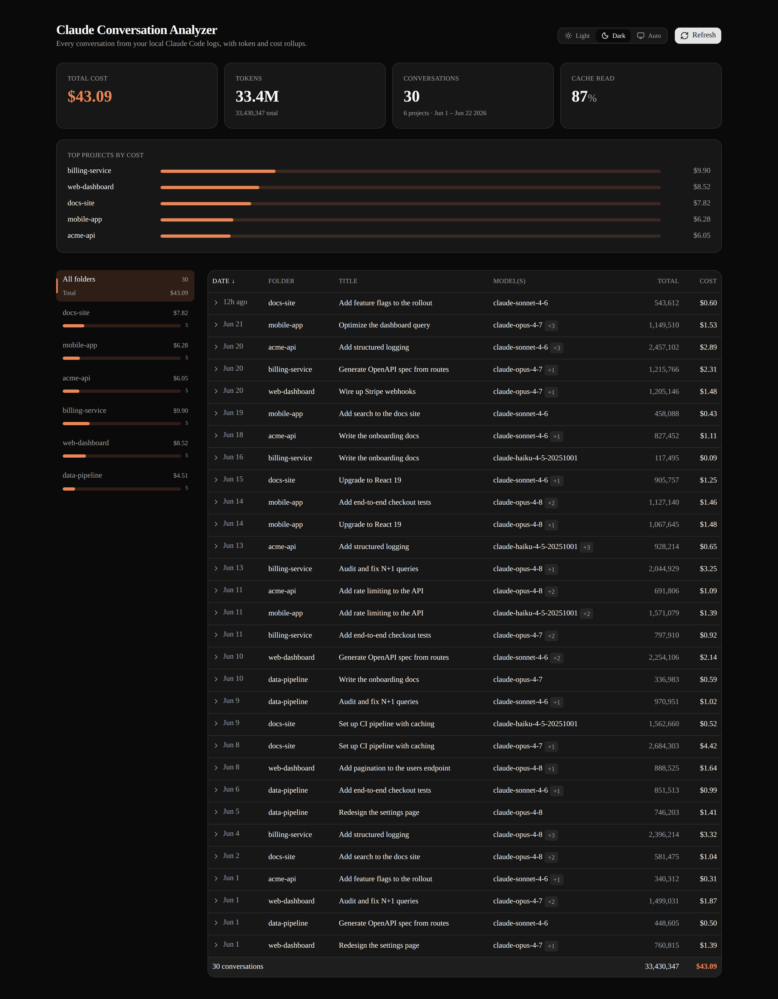
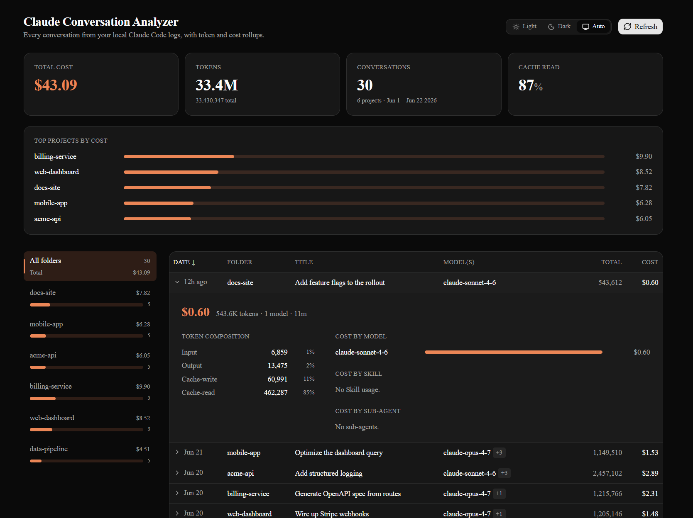

# Claude Conversation Analyzer

A local-only web app that reads the Claude Code conversation logs stored on your
machine, parses them deterministically into a SQLite database, and shows you
per-conversation token usage and cost — broken down by project, model, skill,
and sub-agent.

**Everything stays on your machine.** The app only reads `~/.claude/projects`
and writes a local SQLite file (`./data/analyzer.db`). Nothing is ever sent
anywhere.

## Screenshots

The conversation list — total cost, tokens, and a per-folder breakdown across
every project, sortable by any column:



Expand any row for the per-model, per-skill, and per-sub-agent cost breakdown:



## Requirements

- [Node.js](https://nodejs.org) 20 or newer
- [pnpm](https://pnpm.io)
- Some existing Claude Code usage — the app analyzes the logs Claude Code writes
  to `~/.claude/projects`.

> **Platform support:** Tested on macOS and WSL. It has **not** been tested on
> native Windows and may not work there.

## Getting started

```bash
git clone https://github.com/flolefebvre/claude-convo-analyzer.git
cd claude-convo-analyzer
pnpm install      # also generates the Prisma client (postinstall)
pnpm build
pnpm start
```

Then open [http://localhost:3000](http://localhost:3000).

On first launch the SQLite database is created and migrated automatically — no
manual database setup. Click **Refresh** in the UI to ingest your conversation
logs; the parse is incremental, so subsequent refreshes only read what changed.

For live development instead of a production build:

```bash
pnpm dev
```

## How it works

The app discovers each **project** (a directory where you ran Claude Code) under
`~/.claude/projects`, parses every session's `.jsonl` transcript, and stores a
deterministic, deduplicated token ledger. Cost is computed in application code
from a per-model, per-token-type price list — it's a hypothetical "what these
tokens would list for on the public API today" figure, not your actual billing.

The domain model and the reasoning behind it are documented in
[`CONTEXT.md`](CONTEXT.md) and the ADRs under [`docs/adr/`](docs/adr).

## Roadmap

Today the app answers *"where did the tokens and cost go?"*. The next steps push
it toward *"what actually happened in these conversations, and how do I make them
better?"*

- **Usage stats by skill, tool, and sub-agent.** Go beyond cost to behaviour:
  how often each skill fires, which tools get used the most, how sub-agents are
  distributed across a run — so you can see your real usage patterns at a glance,
  not just the bill.

- **Deeper conversation analysis — surfacing friction.** When running fully
  autonomous, different sub-agents often grind on the *same* underlying problem —
  e.g. a missing piece of context like how to invoke a command. The goal is to
  detect these recurring friction points automatically and make them visible, so
  a single fix (a note in `CLAUDE.md`, a better tool description) can unblock
  every future run instead of each agent rediscovering the wall.

Have an idea or a friction pattern you'd like surfaced? Open an issue.

## Development

The validation gate — all four must pass:

```bash
pnpm test     # vitest
pnpm lint     # eslint
pnpm fallow   # dead code, cycles, duplication, complexity, core boundary
pnpm build    # next build
```

See [`docs/agents/development.md`](docs/agents/development.md) for the testing
approach and fixtures.

## Was this made with AI?

Yes.

## How to contribute

Found a bug or have an idea? Open an issue.

## License

[MIT](LICENSE)
