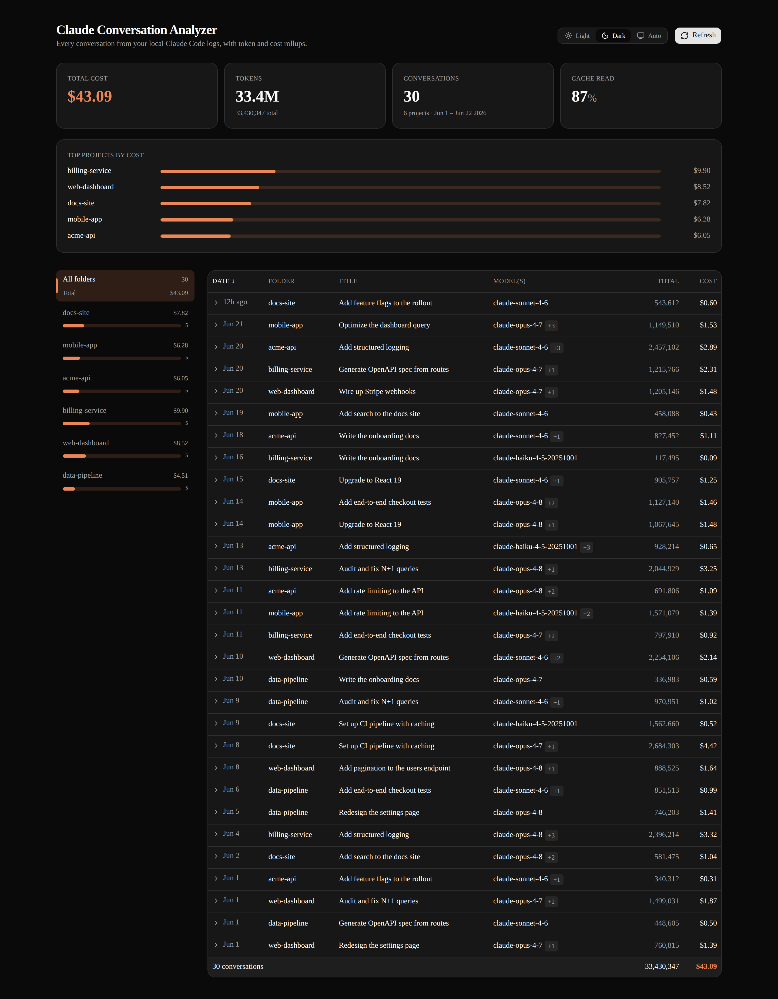
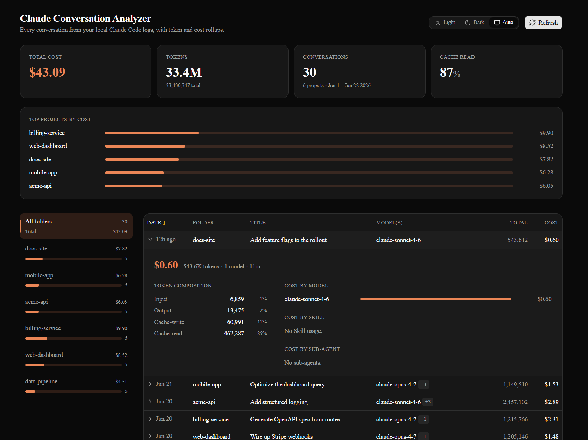
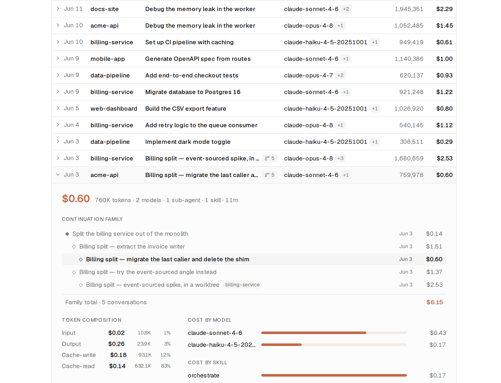
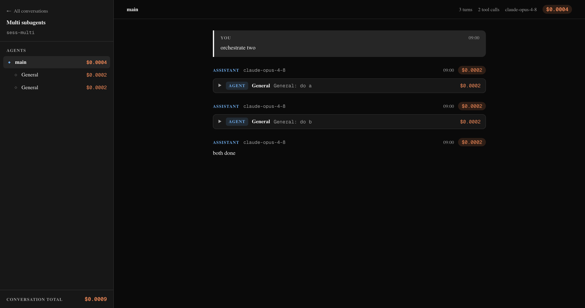
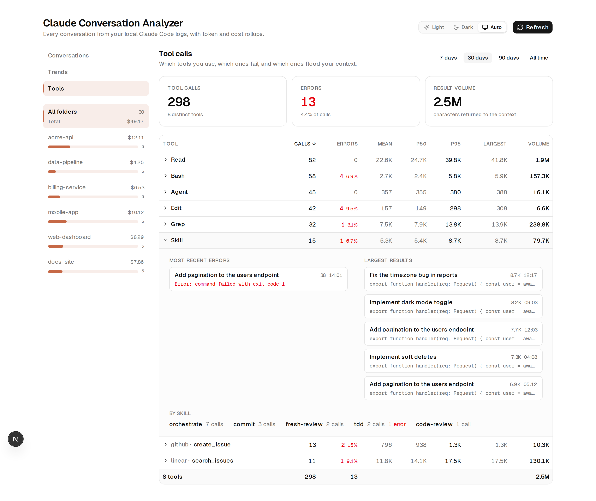
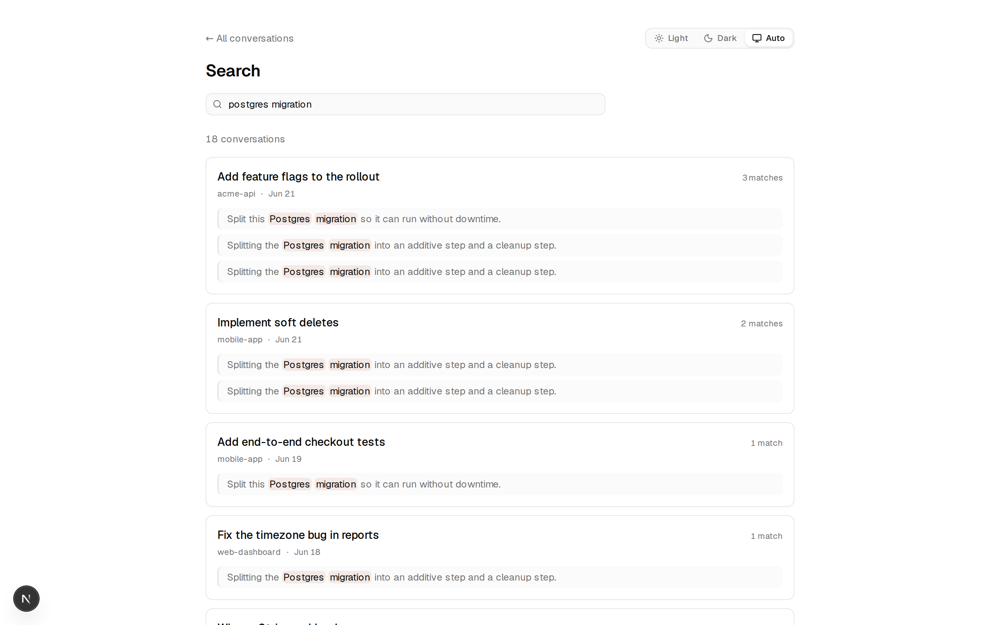

# Claude Conversation Analyzer

A local-only web app that reads the Claude Code conversation logs stored on your
machine, parses them deterministically into a SQLite database, and shows you
per-conversation token usage and cost — broken down by project, model, skill,
and sub-agent.

**Everything stays on your machine.** The app only reads `~/.claude/projects`
and writes a local SQLite file (`./data/analyzer.db`). Nothing is ever sent
anywhere.

> **About the cost figure:** the cost shown is always *"what these tokens would
> cost through the public API"*. If you're on a Pro or Max subscription you
> don't actually pay per token — so treat the number as the equivalent API
> value of your usage, not a bill.

## Screenshots

The conversation list — total cost, tokens, and a per-folder breakdown across
every project, sortable by any column:



Expand any row for the per-model, per-skill, and per-sub-agent cost breakdown:



Work rarely fits in one sitting. When you resume a session (or fork it), Claude
Code starts a new conversation linked to the previous one — so the app groups
them into a **continuation family**: rows that belong to one show a badge with
the family size, and the expanded panel draws the whole family as a tree,
chronological and indented by fork, with each sitting's date and cost, the one
you are looking at highlighted, sittings resumed from another project labelled,
and the cumulative total of the entire piece of work at the bottom. Click any
member to jump to it. The Transcript view of a family member carries the same
lineage as a one-line banner — what it continued from, and what continues it:



Open any conversation for the Transcript view — an IDE-like two-pane view with
the agent tree (main plus every sub-agent, each with its own cost) on the left
and one agent's turn-by-turn transcript on the right. Click a row's title to
land on the main agent, or a sub-agent in the cost breakdown to jump straight
into its transcript:



The Tools page answers a different question: which tools you actually use, which
ones fail, and which ones flood your context. One row per tool — calls, error
count and rate, mean/median/p95 result size, the largest single result, and the
total volume of characters it returned — for the selected project and date
range, sub-agent calls included. Expand a row for its most recent errors and
biggest results, each linking straight to that call in the Transcript:



Search answers the "where did we discuss X?" question. The search box in the
header is on every page; it searches what was *said* — your prompts, Claude's
replies, and conversation titles — across every project, never tool output or
machine-injected noise. Results are grouped into one card per conversation, most
recently matching first, with up to three highlighted extracts; clicking an
extract opens that conversation's transcript at the exact message, in the right
agent. Quoted phrases work too:



## Requirements

- [Node.js](https://nodejs.org) 20 or newer
- [pnpm](https://pnpm.io)
- Some existing Claude Code usage — the app analyzes the logs Claude Code writes
  to `~/.claude/projects`.

> **Platform support:** Tested on macOS and WSL. It has **not** been tested on
> native Windows and may not work there.

## Getting started

```bash
git clone https://github.com/flolefebvre/claude-convo-analyzer.git
cd claude-convo-analyzer
pnpm install      # also generates the Prisma client (postinstall)
pnpm build
pnpm start
```

Then open [http://localhost:3000](http://localhost:3000).

On first launch the SQLite database is created and migrated automatically — no
manual database setup. Click **Refresh** in the UI to ingest your conversation
logs; the parse is incremental, so subsequent refreshes only read what changed.

For live development instead of a production build:

```bash
pnpm dev
```

## How it works

The app discovers each **project** (a directory where you ran Claude Code) under
`~/.claude/projects`, parses every session's `.jsonl` transcript, and stores a
deterministic, deduplicated token ledger. Cost is computed in application code
from a per-model, per-token-type price list — it's a hypothetical "what these
tokens would list for on the public API today" figure, not your actual billing.

The domain model and the reasoning behind it are documented in
[`CONTEXT.md`](CONTEXT.md) and the ADRs under [`docs/adr/`](docs/adr).

## Roadmap

Today the app answers *"where did the tokens and cost go?"*. The next steps push
it toward *"what actually happened in these conversations, and how do I make them
better?"*

- **Usage stats by skill and sub-agent.** The Tools page already covers tool
  usage (calls, errors, result sizes). The same behavioural lens still has to
  reach skills and sub-agents — how often each skill fires, how sub-agents are
  distributed across a run — so you see your real usage patterns, not just the
  bill.

- **Deeper conversation analysis — surfacing friction.** When running fully
  autonomous, different sub-agents often grind on the *same* underlying problem —
  e.g. a missing piece of context like how to invoke a command. The goal is to
  detect these recurring friction points automatically and make them visible, so
  a single fix (a note in `CLAUDE.md`, a better tool description) can unblock
  every future run instead of each agent rediscovering the wall.

Have an idea or a friction pattern you'd like surfaced? Open an issue.

## Development

The validation gate — all four must pass:

```bash
pnpm test     # vitest
pnpm lint     # eslint
pnpm fallow   # dead code, cycles, duplication, complexity, core boundary
pnpm build    # next build
```

See [`docs/agents/development.md`](docs/agents/development.md) for the testing
approach and fixtures.

## Was this made with AI?

Yes.

## How to contribute

Found a bug or have an idea? Open an issue.

## License

[MIT](LICENSE)
